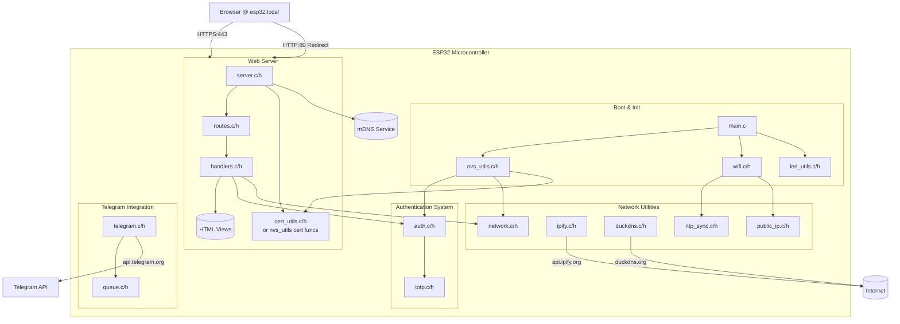
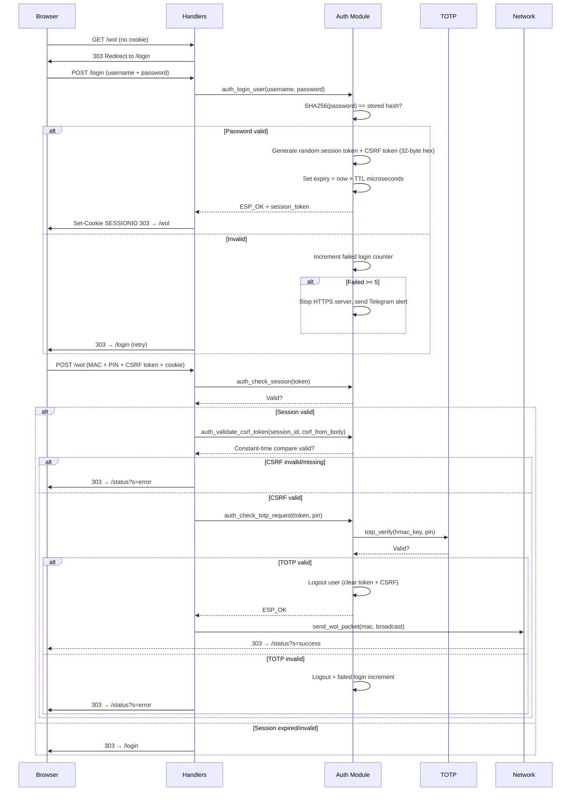
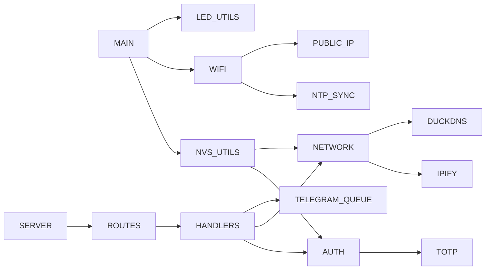
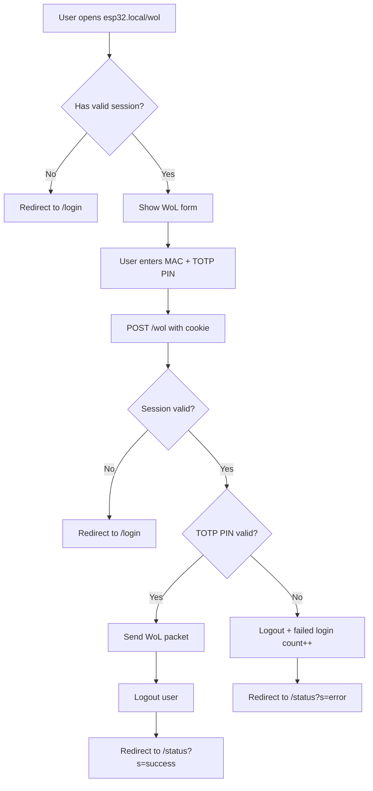
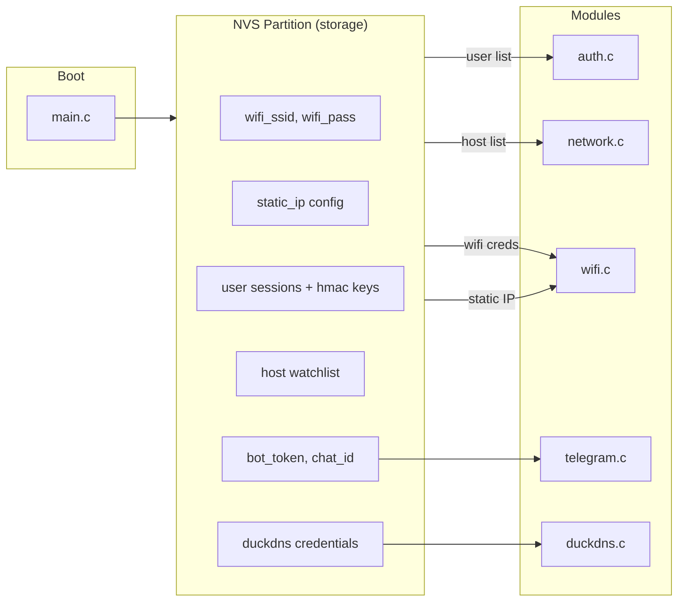
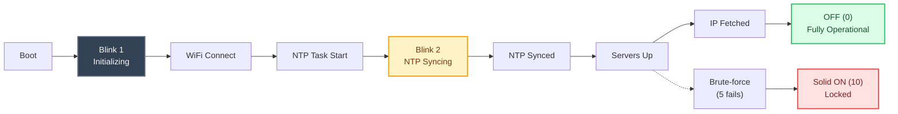
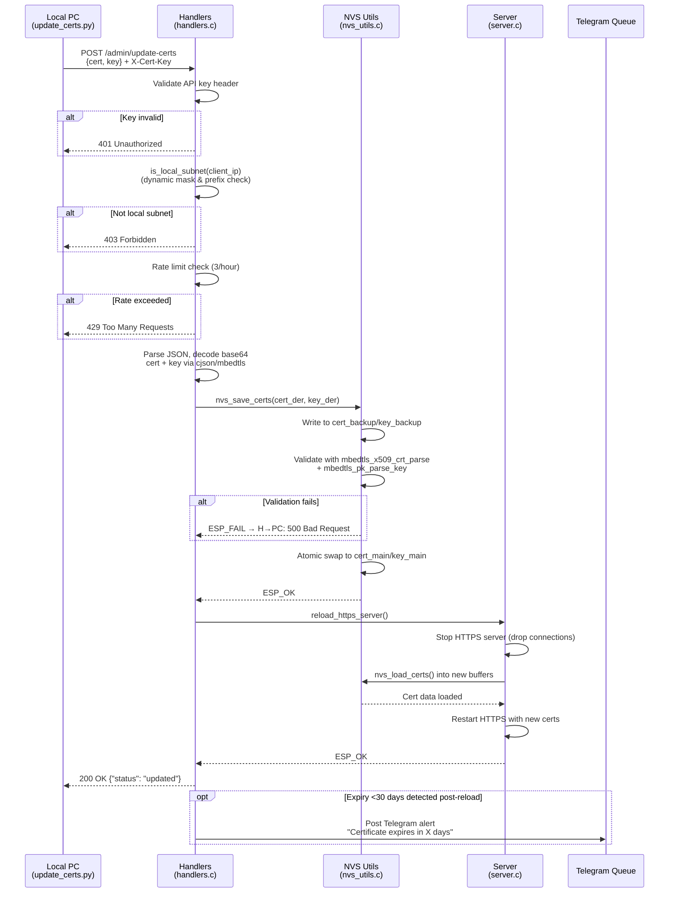
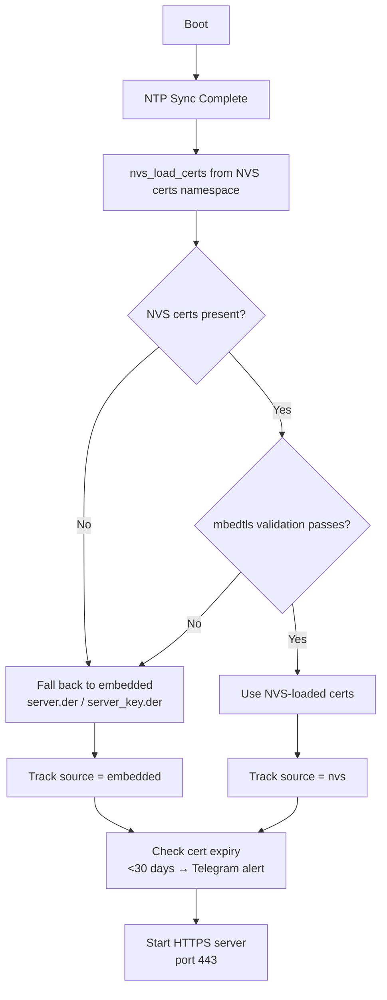

# ESP32WOL - Project Architecture Reference for LLMs

## Purpose

A secure HTTPS web server running on an ESP32 that provides Wake-on-LAN (WoL) functionality with two-factor authentication (2FA). Additional features include host ping monitoring, service port scanning, Telegram notifications, DuckDNS dynamic DNS updates, and public IP tracking.

---

## Architecture Overview



---

## Directory Structure

```
project-root/
├── CMakeLists.txt              # Root project config
├── credentialsFabricator.py    # Python script to generate secrets.csv from .env
├── CredentialUtils/            # Python utilities for credential generation
│   ├── CertUtils.py
│   ├── CreateEnvFile.py
│   └── UserSession.py          # TOTP key + password hash generation
└── main/
    ├── CMakeLists.txt          # Component registration (sources, includes, embedded certs)
    ├── idf_component.yml       # Component dependencies
    ├── main.c                  # Entry point: init NVS → WiFi → start servers
    ├── auth/
    │   ├── auth.c/h            # Login, session mgmt, TOTP verification, brute-force protection
    │   └── totp.c/h            # TOTP generation and verification
    ├── utils/
    │   ├── nvs/nvs_utils.c/h      # NVS partition reader (WiFi, IP config, users, hosts)
    │   │                          # Also handles certificate storage with atomic write strategy:
    │   │                          # nvs_load_certs(), nvs_save_certs(), nvs_has_nvs_certs()
    │   ├── network/network.c/h    # WoL sender, host pinger, service port scanner
    │   ├── telegram/telegram.c/h  # Telegram API client for notifications
    │   ├── telegram/queue.c/h     # Message queue for async Telegram posts
    │   ├── ipify/ipify.c/h        # Fetches public IP from api.ipify.org
    │   ├── duckdns/duckdns.c/h    # Updates DuckDNS with current public IP
    │   ├── led/led_utils.c/h      # LED blinker for status indication
    │   └── utils.c/h              # Shared utilities (URL decode, hex conversion)
    ├── wifi/
    │   ├── wifi.c/h                # WiFi STA init, event handlers, static IP config
    │   ├── ntp_sync/ntp_sync.c/h   # NTP time sync (required for TOTP)
    │   └── public_ip/public_ip.c/h # Public IP fetch task
    └── web/
        ├── certs/                 # Directory where the telegram, api.ipify, and custom certs should be stored
        ├── server/server.c/h      # HTTP→HTTPS redirect + HTTPS server with TLS certs
        │                          # Supports dynamic cert loading from NVS with embedded fallback
        │                          # Includes reload_https_server() for runtime cert updates
        ├── routes/routes.c/h      # Route definitions (uri, method, handler mapping)
        ├── handlers/handlers.c/h  # Request/response logic for each endpoint
        └── views/                 # Embedded HTML pages as string headers
            ├── login.h            # Login form
            ├── wol.h              # WoL trigger page
            ├── service_check.h    # Service scan page
            ├── status.h           # Success/error status display
            └── copyIp.h           # Public IP display with copy button
```

---

## How It Works

### 1. Boot Sequence (main.c)

1. Initialize NVS flash, network stack, and event loop
2. Start LED blinker for visual feedback (`led_utils_set_blinks(1)` — booting indicator)
3. Load secrets from NVS `storage` partition:
   - WiFi credentials → start WiFi STA
   - User sessions → pass to auth module via `auth_set_user_list()`
   - Host watchlist → pass to network module via `network_set_host_list()`
4. Create authentication mutex semaphore
5. Load TLS certificates from NVS certs namespace via `nvs_load_certs()` into dynamically allocated RAM buffers
   - If NVS certs are missing or fail mbedtls validation, fall back to embedded self-signed defaults (`server.der` / `server_key.der`)
   - Certificate source (NVS vs embedded) is tracked for status reporting

### 2. WiFi Connection & Telegram Queue Init (wifi.c)

- Connects as station using SSID/password from NVS
- Optionally configures static IP (disabled by default, controlled by `use_static_ip` in NVS)
- **Telegram queue is initialized** inside `wifi_init_sta()` via `initialize_notifications_queue()` — this must happen before any task can post messages
- On successful connection (`IP_EVENT_STA_GOT_IP`):
  - Wakes up the public IP fetch task via `xTaskNotifyGive()`
  - Starts NTP synchronization task (critical for TOTP time alignment)

### 3. NTP Sync & Server Startup (ntp_sync.c)

**Critical**: The HTTPS server requires valid system time (for TLS certificate validation). Therefore, **server startup is deferred until after NTP sync completes**.

1. NTP task waits indefinitely for initial time sync (`timeinfo.tm_year >= 2020 - 1900`)
2. Once synced:
   - LED blink pattern set to `2` (NTP syncing complete)
   - mDNS service started (`esp32.local` registered)
   - HTTP redirect server started on port 80
   - HTTPS server started on port 443 with embedded DER certificates
   - Public IP management task spawned

**Maintenance loop**: After initial startup, NTP syncs periodically:

- Every 24 hours during "night" window (1AM–5AM UTC) to conserve resources
- Mandatory re-sync every 72 hours regardless of time
- Failed syncs retry after 15 minutes

**Certificate Expiry Monitoring**: During each maintenance sync cycle, the loaded certificate's `notAfter` field is parsed via mbedtls and compared to current system time. If expiration is within **30 days**, a Telegram alert is posted: "Certificate expires in X days. Wake PC and run update_certs.py."

- Expiry is also checked immediately at boot (after NTP sync) and after every `reload_https_server()` call, avoiding up-to-24h delay for unexpected expirations
- Warnings are logged to serial console for debugging

### 4. Public IP Management (public_ip.c)

- Runs as a background task, gated by WiFi connection state
- Checks public IP from `api.ipify.org` every **20 minutes** on success
- Retries every **10 seconds** on failure
- On first successful boot: sends Telegram notification with URL (`https://{ip}:{custom_port}`) and updates DuckDNS
- On IP change: sends Telegram notification and updates DuckDNS
- The provided custom port will be used in the Telegram notifications (not 443)

### 5. Web Server Startup (server.c)

- **HTTP** server (port 80): Redirects ALL requests to HTTPS via 301
- **HTTPS** server (port 443): Serves actual content using certificates loaded at runtime
- **mDNS**: Registers esp32.local for local network discovery

- **Certificate Loading Strategy**:
  - At boot: attempts to load DER cert/key from NVS `certs` namespace into dynamically allocated buffers via nvs_load_certs()
  - If NVS certs are missing, empty, or fail mbedtls validation → falls back to embedded self-signed defaults (`server.der`, `server_key.der`)
  - Embedded fallback certs remain in firmware as a safety net during rollout (can be removed later)

- **Runtime Reload**: reload_https_server() safely stops the HTTPS server, frees old cert buffers, reloads from NVS, and restarts — protected by auth mutex. Active connections are dropped with TCP reset during transition (503 handling not implemented; acceptable tradeoff for simplicity).

Certificates can be embedded at compile time via EMBED_FILES in CMakeLists.txt as fallback defaults. Root CA PEM files remain embedded for outbound HTTPS clients (ipify, DuckDNS, Telegram APIs).

### 6. Authentication Flow (auth.c)



### 7. NVS Storage Schema (secrets.csv)

Generated by `credentialsFabricator.py` from `.env` variables and JSON config files.

| Key Pattern                               | Type   | Description                                               |
| ----------------------------------------- | ------ | --------------------------------------------------------- |
| `total_users`                             | u8     | Number of user accounts                                   |
| `total_hosts`                             | u8     | Number of monitored hosts                                 |
| `wifi_ssid` / `wifi_pass`                 | string | WiFi credentials                                          |
| `use_static_ip`                           | u8     | 0=DHCP, 1=static IP                                       |
| `static_ip` / `router_gw` / `router_mask` | string | Static IP config (optional)                               |
| `bot_token` / `chat_id`                   | string | Telegram bot credentials                                  |
| `duckdns_token` / `duckdns_domain`        | string | DuckDNS credentials                                       |
| `user_{N}_name`                           | string | Username for session N                                    |
| `user_{N}_TTL`                            | u8     | Session timeout in seconds                                |
| `user_{N}_hash`                           | string | SHA256 hash of password (hex, 64 chars)                   |
| `user_{N}_hmac`                           | blob   | 10-byte binary TOTP secret key                            |
| `alias_h_{i}` / `ip_h_{i}`                | string | Host alias and IP for watchlist index i                   |
| `ports_h_{i}`                             | string | Pipe-delimited ports (e.g., `"80\|443"`)                  |
| `port_names_h_{i}`                        | string | Pipe-delimited port names (e.g., `"http\|https"`)         |
| `cert_main`                               | blob   | DER-encoded TLS certificate (loaded from certs namespace) |
| `key_main`                                | blob   | DER-encoded private key (loaded from certs namespace)     |
| `cert_backup`                             | blob   | Temporary cert storage for atomic write strategy          |
| `key_backup`                              | blob   | Temporary key storage for atomic write strategy           |
| `cert_update_key`                         | string | Secret API key required for /admin/update-certs endpoint  |

Certificate Namespace: Certificates are stored in a separate NVS namespace (`certs`) to isolate them from user/host data. The atomic write strategy writes to `cert_backup`/`key_backup` first, validates with mbedtls, then swaps to `cert_main`/`key_main`. This prevents corruption from power loss during writes.

### 8. Web Routes Summary

| Route                 | Method | Auth Required                                                             | Description                                                                                                                 |
| --------------------- | ------ | ------------------------------------------------------------------------- | --------------------------------------------------------------------------------------------------------------------------- |
| `/`                   | GET    | No                                                                        | Redirects to `/login`                                                                                                       |
| `/ip`                 | GET    | No                                                                        | Redirects to `/copyIp?ip={public_ip}`                                                                                       |
| `/copyIp`             | GET    | No                                                                        | Displays public IP with copy button                                                                                         |
| `/login`              | GET    | No                                                                        | Login form page                                                                                                             |
| `/login`              | POST   | No                                                                        | Validates credentials, sets session cookie                                                                                  |
| `/status`             | GET    | No                                                                        | Shows success/error from query param `?s=`                                                                                  |
| `/wol`                | GET    | Session cookie                                                            | WoL configuration page                                                                                                      |
| `/wol`                | POST   | Session + CSRF token + TOTP                                               | Sends Wake-on-LAN packet                                                                                                    |
| `/serviceCheck`       | GET    | Session cookie                                                            | Service scan page                                                                                                           |
| `/serviceCheck`       | POST   | Session + CSRF token + TOTP                                               | Scans host ports, sends Telegram report                                                                                     |
| `/ping`               | POST   | Session + CSRF token + TOTP                                               | Pings all hosts in watchlist                                                                                                |
| `/admin/update-certs` | POST   | X-Cert-Key header + dynamic local subnet validation + rate limit (3/hour) | Accepts JSON with base64-encoded DER cert+key, validates via mbedtls, saves to NVS atomically, triggers HTTPS server reload |
| `/admin/cert-status`  | GET    | None (local network only recommended)                                     | Returns JSON: { "expiry": "YYYY-MM-DD", "days_remaining": 45, "source": "nvs" }                                             |

### 9. Security Features

- **HTTPS only**: HTTP redirects to HTTPS with embedded TLS certificates (DER format)
- **Password hashing**: SHA256 stored in NVS, compared server-side via mbedtls
- **Session tokens**: Random 16-byte hex (32 chars), HttpOnly + Secure + SameSite=Strict cookies
- **TOTP 2FA**: Required for WoL/ping/scan actions (HMAC-SHA1 based, 10-byte key, 6-digit codes, 30-second period per RFC 6238)
- **Brute-force protection**: Server shuts down after 5 failed login attempts, Telegram alert sent
- **Credential wiping**: WiFi credentials cleared from RAM immediately after use with `memset()`
- **Dynamic certificate management**: Certificates loaded from NVS at runtime with embedded fallback; no reflashing required for renewal
- **Atomic cert writes**: Power-loss-safe NVS update via backup/verify/swap pattern; corrupted writes trigger fallback to embedded certs
- **Admin endpoint protection**: `/admin/update-certs` requires `X-Cert-Key` header (stored in NVS), dynamic local subnet validation, and rate limiting (3 attempts/hour with RAM-based sliding window)
- **Certificate expiry monitoring**: Automatic Telegram alerts when cert expires within 30 days; checked at boot, post-reload, and every NTP maintenance cycle
- **CSRF token protection**: All state-changing POST endpoints (/wol, /ping, /serviceCheck) require a session-bound, cryptographically random 32-byte hex CSRF token submitted as a hidden form field. Tokens are validated using constant-time comparison to prevent timing side-channels before TOTP verification proceeds.
- **Dynamic subnet validation**: The /admin/update-certs endpoint validates the client IP against the ESP32's actual assigned subnet (from NVS static IP config or DHCP-assigned interface info) instead of a hardcoded 192.168.x.x range, preventing abuse via port forwarding on non-RFC1918 networks.

---

## External Dependencies

| Dependency         | Purpose                                                        |
| ------------------ | -------------------------------------------------------------- |
| `espressif/mdns`   | Local network discovery via esp32.local                        |
| `esp_https_server` | HTTPS server with TLS support                                  |
| `esp_http_client`  | HTTP client for ipify, DuckDNS, Telegram APIs                  |
| `mbedtls`          | SHA256 hashing, HMAC for TOTP                                  |
| `espressif/cjson`  | JSON parsing for /admin/update-certs payload (base64 cert/key) |

---

## Build and Flash Process

### Step 1: Generate Credentials

```bash
# Create .env file with secrets (see README.md template)
python credentialsFabricator.py  # Outputs secrets.csv
```

### Step 2: Create NVS Binary

```bash
python $IDF_PATH/components/nvs_flash/nvs_partition_generator/nvs_partition_gen.py \
    generate secrets.csv secrets.bin 0x10000
```

The `0x10000` size must match the partition definition in `partitions.csv`.

### Step 3: Generate TLS Certificates

```bash
# Self-signed server cert (DER format for ESP32)
openssl req -x509 -newkey rsa:2048 -keyout server.key -out server.crt \
    -days 3650 -nodes -sha256
openssl x509 -in server.crt -outform der -out main/web/certs/server.der
openssl rsa -in server.key -outform der -out main/web/certs/server_key.der

# Root certs for external APIs (use getroot function from README)
```

Place root certs in `main/web/certs/` as `.pem` files (`api_ipify.pem`, `duckdns.pem`, `telegram.pem`).

- **Note**: Embedded certificates (`server.der`, `server_key.der`) are still generated at build time as a fallback safety net. After the dynamic cert feature is thoroughly tested, these can be removed from `EMBED_FILES` in CMakeLists.txt. The `/admin/update-certs` endpoint allows pushing new certs to NVS without reflashing firmware.

### Step 4: Flash to ESP32

```bash
idf.py flash
parttool.py --partition-table-file partitions.csv write_partition \
    --partition-name storage --input secrets.bin
```

Reset the SOC after flashing.

### Step 5: Push Certificates at Runtime (Optional)

After initial flash, certificates can be updated remotely via the admin endpoint:

```bash
curl -k -X POST https://esp32.local/admin/update-certs \
  -H "Content-Type: application/json" \
  -H "X-Cert-Key: YOUR_CERT_UPDATE_KEY" \
  -d '{"cert": "<base64_der_cert>", "key": "<base64_der_key>"}'

# Check certificate status:
curl -k https://esp32.local/admin/cert-status
```

---

## Key Design Decisions

1. **NVS partition for secrets**: Credentials stored in a separate flash partition, not in app filesystem
2. **No persistent session storage**: Sessions exist only in RAM; reboot logs out all users
3. **TOTP requires NTP sync**: Time-based codes need accurate system time, synced after WiFi connects
4. **Telegram queue**: Messages queued to avoid blocking HTTP handlers during API calls
5. **Single-use sessions**: After a WoL/ping/scan action, the session is invalidated (auto-logout)
6. **Magic number auth lock**: Uses `0x5A5A` / `0xA5A5` patterns instead of boolean to prevent trivial tampering
7. **NVS fallback for certs**: Embedded self-signed certificates remain in firmware as a safety net during rollout; can be removed once dynamic cert management is proven stable
8. **Atomic NVS writes for certs**: Certificates written to backup keys first, validated with mbedtls, then swapped — prevents corruption from power loss during update
9. **Admin endpoint security triad**: `X-Cert-Key` header + dynamic local subnet validation (computed from NVS interface config) + rate limiting (3 attempts/hour) protects the cert update endpoint even if port-forwarded or deployed on non-standard subnets.
10. **Expiry monitoring at multiple checkpoints**: Certificate expiry checked at boot, after reload, and during NTP maintenance cycle — ensures <24h detection window for unexpected expirations
11. **CSRF mitigation for state-changing endpoints**: Session-bound 32-byte hex tokens generated via `esp_fill_random()` on login, injected into HTML forms server-side, and validated with constant-time comparison before any TOTP check, prevents cross-site request forgery even when `SameSite=Strict` is bypassed.

---

## Mermaid Diagrams Reference

### Component Dependency Graph



### Data Flow for WoL Request



### NVS Loading Flow



### ESP32 LED States Reference

The built-in LED is on **GPIO 2** (active-high). The blink logic works as follows:

- `blinks = 0` → LED always **OFF**
- `blinks = 1–9` → Blink N times, pause (~1.5s), repeat
- `blinks ≥ 10` → LED always **ON**

| Blinks | State Name                    | Meaning                                        | Set In                                                     | Details                                                                                                                                                                                          |
| ------ | ----------------------------- | ---------------------------------------------- | ---------------------------------------------------------- | ------------------------------------------------------------------------------------------------------------------------------------------------------------------------------------------------ |
| `1`    | Booting / Initializing        | System is starting up, WiFi connecting         | [`main.c`](main/main.c)                                    | First state set at boot. Single blink per cycle indicates the device is initializing NVS, loading credentials, and attempting to connect to WiFi.                                                |
| `2`    | NTP Syncing                   | Waiting for time synchronization               | [`ntp_sync/ntp_sync.c`](main/wifi/ntp_sync/ntp_sync.c)     | Set when the NTP management task starts. The system is waiting for a valid time from `pool.ntp.org`. **Servers (HTTP/HTTPS/mDNS) will not start until this completes.** Double blink per cycle.  |
| `0`    | Fully Operational             | System is online and ready                     | [`public_ip/public_ip.c`](main/wifi/public_ip/public_ip.c) | Set after the first successful public IP fetch from `api.ipify.org`. LED turns off completely to indicate normal operation. Telegram notification sent with the access URL.                      |
| `10`   | Locked / Brute-Force Shutdown | Server shut down due to too many failed logins | [`auth/auth.c`](main/auth/auth.c)                          | Set when 5 consecutive failed login attempts are reached. LED stays **solid ON** as a warning indicator. The HTTPS server is stopped and a Telegram alert is sent. Requires a reboot to recover. |

---

### Quick Visual Summary



### Certificate Update Flow



### Certificate Boot & Fallback Flow



### Default Timings (from `led_utils.h`)

| Parameter                    | Value   | Description                                      |
| ---------------------------- | ------- | ------------------------------------------------ |
| `LED_DEFAULT_BLINK_ON_MS`    | 300 ms  | LED on duration per blink                        |
| `LED_DEFAULT_BLINK_OFF_MS`   | 300 ms  | LED off duration between blinks                  |
| `LED_DEFAULT_CYCLE_PAUSE_MS` | 1500 ms | Pause after completing N blinks before repeating |

So for example, **blink(2)** means: ON (300ms) → OFF (300ms) → ON (300ms) → OFF (300ms) → PAUSE (1500ms) → repeat.

---

## Key API Functions Reference

### auth.c/h

| Function                                                  | Description                                                                                                                                                                                                                                                                                                                                                                            |
| --------------------------------------------------------- | -------------------------------------------------------------------------------------------------------------------------------------------------------------------------------------------------------------------------------------------------------------------------------------------------------------------------------------------------------------------------------------- |
| `auth_set_user_list(list, count)`                         | Initialize user sessions from NVS data                                                                                                                                                                                                                                                                                                                                                 |
| `auth_login_user(username, password, out_token, ttl_out)` | Validate credentials, generate session token, and **output the session TTL** to `ttl_out`                                                                                                                                                                                                                                                                                              |
| `auth_check_session(token)`                               | Verify session validity and expiry                                                                                                                                                                                                                                                                                                                                                     |
| `auth_check_totp_request(token, pin)`                     | Verify TOTP PIN for sensitive actions                                                                                                                                                                                                                                                                                                                                                  |
| `auth_logout_user(token)`                                 | Clear a single user's session                                                                                                                                                                                                                                                                                                                                                          |
| `auth_logout_all_users()`                                 | Clear all sessions (e.g., on reboot)                                                                                                                                                                                                                                                                                                                                                   |
| `auth_semaphore_init()`                                   | Create mutex for thread-safe auth operations                                                                                                                                                                                                                                                                                                                                           |
| `initialize_notifications_queue()`                        | Initializes the FreeRTOS message queue and spawns the background sender task (called inside `wifi_init_sta`)                                                                                                                                                                                                                                                                           |
| `post_message_to_queue(fmt, silent, ...)`                 | **Variadic function**. Enqueues a formatted string for async Telegram delivery. Accepts `printf`-style format specifiers (`%s`, `%d`, etc.) after the `silent` boolean. Internally uses `vsnprintf` to safely build the message before queuing. Returns `true` on success, `false` if queue is full/uninitialized. Example: `post_message_to_queue("IP changed to %s", true, new_ip);` |
| `send_telegram_message_sync(message, silent)`             | **Low-level sync function**. Sends a Telegram message immediately (blocks until complete). Used internally by the queue task; generally prefer `post_message_to_queue` for non-blocking operation.                                                                                                                                                                                     |
| `auth_get_csrf_token(session_id, out_buf)`                | Retrieve the CSRF token for an active session; copies up to 32 hex chars + null terminator into out_buf                                                                                                                                                                                                                                                                                |
| `auth_validate_csrf_token(session_id, provided_token)`    | Constant-time comparison of a submitted CSRF token against the session's stored token; returns true on match                                                                                                                                                                                                                                                                           |

### nvs_utils.c/h

| Function                                                           | Description                                                                                                                                                                                          |
| ------------------------------------------------------------------ | ---------------------------------------------------------------------------------------------------------------------------------------------------------------------------------------------------- |
| `nvs_init_and_load_secrets()`                                      | Initialize NVS partition, load users and hosts                                                                                                                                                       |
| `nvs_get_wifi_credentials(ssid, ssid_len, pass, pass_len)`         | Fetch WiFi SSID/password                                                                                                                                                                             |
| `nvs_get_static_ip_config(ip_info, static_enabled)`                | Fetch static IP config if enabled                                                                                                                                                                    |
| `nvs_get_telegram_secrets(token, token_len, chat_id, chat_id_len)` | Fetch Telegram bot credentials                                                                                                                                                                       |
| `nvs_get_duckdns_secrets(token, token_len, domain, domain_len)`    | Fetch DuckDNS credentials                                                                                                                                                                            |
| `nvs_load_certs(cert_buf, cert_len, key_buf, key_len)`             | Load DER-encoded cert/key from NVS certs namespace into provided buffers. Returns ESP_OK on success; callers should check for empty/invalid data and fall back to embedded certs if needed.          |
| `nvs_save_certs(cert_data, cert_size, key_data, key_size)`         | Atomically save validated DER blobs to NVS using backup/verify/swap strategy: writes to cert_backup/key_backup, validates with mbedtls, then swaps to cert_main/key_main. Returns ESP_OK on success. |
| `nvs_has_nvs_certs()`                                              | Check whether valid certificate data exists in NVS (returns true if cert_main and key_main are present and non-empty). Useful for determining cert source at boot.                                   |

### handlers.c/h

| Function                                             | Description                                                                                                                                                                                                                                                                                                                                                |
| ---------------------------------------------------- | ---------------------------------------------------------------------------------------------------------------------------------------------------------------------------------------------------------------------------------------------------------------------------------------------------------------------------------------------------------- |
| `_get_cookie_value(req, cookie_name, val, val_size)` | Parse session token from Cookie header                                                                                                                                                                                                                                                                                                                     |
| `http_redirect_handler(req)`                         | Redirect HTTP → HTTPS (301)                                                                                                                                                                                                                                                                                                                                |
| `https_redirect_handler(req)`                        | Internal HTTPS redirects (e.g., / → /login)                                                                                                                                                                                                                                                                                                                |
| `post_login_handler(req)`                            | Handle login POST, set session cookie                                                                                                                                                                                                                                                                                                                      |
| `get_wol_handler(req)`                               | Serve WoL page if authenticated                                                                                                                                                                                                                                                                                                                            |
| `post_wol_handler(req)`                              | Validate TOTP, send WoL packet                                                                                                                                                                                                                                                                                                                             |
| `post_ping_handler(req)`                             | Validate TOTP, ping all hosts                                                                                                                                                                                                                                                                                                                              |
| `post_serviceCheck_handler(req)`                     | Validate TOTP, scan services                                                                                                                                                                                                                                                                                                                               |
| `post_update_certs_handler(req)`                     | POST /admin/update-certs: Validates X-Cert-Key header, checks local subnet (192.168.x.x), enforces rate limit (3 attempts/hour via RAM sliding window), parses JSON payload with cjson, decodes base64 cert/key, validates pair with mbedtls, saves to NVS atomically, triggers reload_https_server(). Returns 200 on success, 401/403/429/500 on failure. |
| `get_cert_status_handler(req)`                       | GET /admin/cert-status: Parses loaded certificate's notAfter field via mbedtls, computes days remaining, determines source ("nvs" or "embedded"), returns JSON response with expiry date and status. No authentication required (intended for local monitoring).                                                                                           |
| `is_local_subnet(client_ip)`                         | Fetches ESP32 local IP and subnet mask from NVS, applies bitwise AND with mask on both addresses, compares network prefixes; returns true if client is on the same LAN segment                                                                                                                                                                             |

- **Note**:
  - **GET handlers** (`get_wol_handler`, etc.): After session verification, retrieves CSRF token via `auth_get_csrf_token()` and performs safe string replacement on embedded HTML views to inject <input type="hidden" name="csrf_token" value="..."> before sending response.
  - **POST handlers** (`post_wol_handler`, etc.): Extracts `csrf_token` from request body, validates via `auth_validate_csrf_token()` **before** TOTP verification. Returns 403/redirect on failure.

### network.c/h

| Function                                  | Description                             |
| ----------------------------------------- | --------------------------------------- |
| `network_set_host_list(list, count)`      | Initialize host watchlist from NVS data |
| `send_wol_packet(mac, secure, broadcast)` | Send Wake-on-LAN UDP packet             |
| `network_ping_all_hosts()`                | ICMP ping all hosts in watchlist        |
| `network_scan_services()`                 | TCP port scan on watched hosts/ports    |

### server.c/h

| Function                       | Description                                                                                                                                                                                                                                                                    |
| ------------------------------ | ------------------------------------------------------------------------------------------------------------------------------------------------------------------------------------------------------------------------------------------------------------------------------ |
| `start_http_redirect_server()` | Start HTTP→HTTPS redirect server (port 80)                                                                                                                                                                                                                                     |
| `start_https_server()`         | Start HTTPS server with TLS certs (port 443)                                                                                                                                                                                                                                   |
| `start_mdns_service()`         | Register esp32.local via mDNS                                                                                                                                                                                                                                                  |
| `reload_https_server()`        | Safely stops the HTTPS server, frees old certificate buffers, reloads certs from NVS via nvs_load_certs(), and restarts the HTTPS context. Protected by auth mutex for thread safety. Active connections are dropped during transition (TCP reset). Returns ESP_OK on success. |

---

## Notes for LLMs Working on This Project

- All paths in C code are relative to the `main/` directory (e.g., `"./utils/nvs/nvs_utils.h"`)
- HTML views are stored as string constants in `.h` files, not separate `.html` files
- The NVS partition is read-only after flashing; no runtime writes to secrets
- Session state lives entirely in RAM — a reboot invalidates all sessions
- TOTP verification requires accurate system time (NTP synced after WiFi connects)
- The auth module uses magic numbers (`AUTH_LOCKED_MAGIC` / `AUTH_UNLOCKED_MAGIC`) instead of booleans for the lock status
- Failed login tracking is global across all users, not per-user
