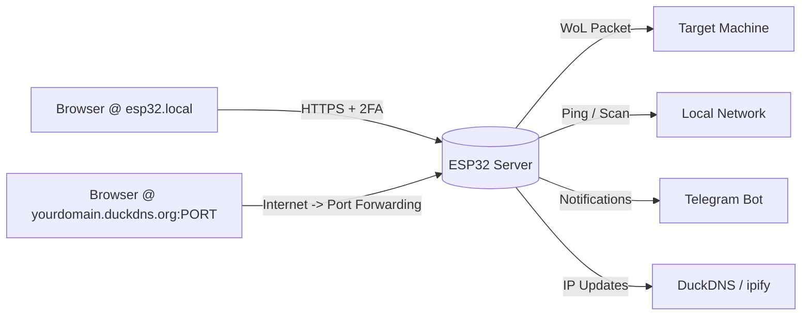

# ESP32WOL

A secure, self-hosted HTTPS web server running on an ESP32 that provides Wake-on-LAN (WoL) functionality with two-factor authentication (2FA). 

Designed for both local network convenience and remote access over the internet this firmware monitors network hosts via ping/port scanning, tracks; updates; and notifies you of the network's public IP, updates DuckDNS dynamically (), and sends Telegram notifications for status changes, alerts, and certificate expiry warnings.

If you're an LLM or want a deep architectural breakdown, please read [LLMs.md](./LLMs.md).

---

## How It Works



1. **Locally**: Connect to `https://esp32.local` on your LAN.
    - **Remotely**: Access via `https://<YOUR_DOMAIN_HERE>.duckdns.org:<YOUR_PORT_HERE>` after configuring port forwarding.
3. Log in with your username & password, then verify any action with a 6-digit TOTP code from your authenticator app.
4. Trigger Wake-on-LAN, ping hosts, scan services, or manage certificates securely from anywhere.

---

## Key Features

| Category | Capabilities |
|---|---|
| **Security** | HTTPS-only, SHA256 password hashing (this is **not safe encryption for passwords** as they can be bruteforced, but the server locks down on 5 bad guesses so...), TOTP 2FA for all actions, bruteforce protection, secure session cookies (`HttpOnly`, `Secure`, `SameSite=Strict`) |
| **Remote Access** | (Optional) DuckDNS dynamic DNS integration, custom port support for router forwarding, public IP tracking via `api.ipify.org` |
| **Notifications** | (Optional) Telegram bot alerts for IP changes, service scan results, ping status, and certificate expiry warnings (<30 days) |
| **Network Tools** | Wake-on-LAN sender, ICMP host pinger, TCP port scanner with custom watchlist & service names |
| **Certificate Management** | Runtime cert updates via `/admin/update-certs` (no reflashing), power loss safe NVS writes, mbedtls validation, automatic expiry monitoring |
| **Status Indicators** | Built-in LED blink patterns for boot, NTP sync, operational state, and lockout status (so you don't have to read live logs to figure out if it got stuck or locked) |

- **Password Security Note**: Passwords are hashed using salted `PBKDF2-HMAC-SHA256` (100,000 iterations). This makes offline brute-force attacks significantly slower and more resource-intensive compared to standard hashing algorithms. 
    - Combined with TOTP 2FA and automatic server lockouts after failed attempts, the firmware provides robust protection against both online guessing and offline credential extraction.

Neither Telegram or DuckDNS are required for the project to work locally, so it's a good idea to test locally first and then spend time creating the bot and DuckDns domain if you plan to expose it over the internet.

---

## Requirements

### Hardware
- **ESP32 Microcontroller**: Any ESP32 dev board (e.g., ESP32-WROOM, ESP32-S3).
  - *Note*: Default config assumes ≥4 MB flash. Adjust via `idf.py menuconfig` if needed.

### Software & Tools
- **ESP-IDF Framework**: Official Espressif IoT Development Framework.
  - [Get Started with ESP-IDF](https://docs.espressif.com/projects/esp-idf/en/latest/esp32/get-started/index.html)
- **Python 3.x**: For `credentialsFabricator.py` and NVS binary generation.
    - I used Python 3.14.
- **OpenSSL**: TLS certificate generation & root CA fetching.
    - This is so the Esp32 can connect to other sites (NTP clock sync, api.ipify, etc.) and verify their identity (you wouldn't like to receive a malicious ip masking as your own to catch your credentials!).

### External Services
1. **Telegram Bot**: (Optional) Status alerts & reports (`BOT_TOKEN` + `CHAT_ID`)
2. **DuckDNS**: (Optional) Dynamic DNS for remote access (`DUCKDNS_TOKEN` + domain)
3. **Authenticator App**: TOTP 2FA (Any authenticator app like Google Authenticator, Authy, KeePassXC, etc.)

### Network Configuration
- **Wake-on-LAN**: Enabled in target PC BIOS & network adapter settings. MAC address required.
    - Make sure WOL works before going forward with this project.
        - WOL normally only works if the target is connected via ethernet.
        - The right MAC address for the ethernet connected network card is required.
        - Both devices MUST be on the same network.
- **Port Forwarding** (Optional but recommended for remote use): Forward your chosen HTTPS port to the ESP32's local IP. Using a non-standard port (e.g., `8443`) is somewhat safer than `443` to avoid automated internet scanners.

---

## Getting Started

### 1. ESP-IDF Configuration
Run `idf.py menuconfig` and set:
- **Serial flasher config** -> Flash size -> `4 MB`
- **Partition Table** -> Custom partition table CSV (default)
- **Component config** -> ESP-TLS -> Enable client session tickets
- **Component config** -> ESP HTTPS server -> Enable ESP_HTTPS_SERVER component

### 2. Install Dependencies
```bash
idf.py add-dependency "espressif/mdns"
idf.py add-dependency "espressif/cjson"
```

### 3. Generate Credentials & Certificates

#### A. Create `.env` file
Place in project root with your secrets:
```bash
# WiFi & Network
WIFI_NAME="YOUR_WIFI_SSID"
WIFI_PASSWORD="YOUR_WIFI_PASS"

# (Optional) Static IP for the ESP32
STATIC_IP="192.168.1.50"
ROUTER_GATEWAY_IP="192.168.1.1"
ROUTER_MASK="255.255.255.0"

# Telegram Bot (Optional)
TELEGRAM_BOT_TOKEN="YOUR_BOT_TOKEN"
TELEGRAM_CHAT_ID="YOUR_CHAT_ID"

# TOTP Settings
TOTP_LABEL="Home_ESP32"
TOTP_ISSUER="ESP32WOL"
SET_AUTO_RANDOM_PASSWORDS=true

# User Sessions & Host Watchlist (or use sessions.json / watchlist.json for easier formatting)
USER_SESSIONS=[{"username": "admin", "timeout": 90}]
HOST_WATCHLIST=[{"alias":"My PC","ip":"192.168.1.10","ports":[{"name":"HTTP","port":80}]}]

# DuckDNS (Optional, for remote access)
DUCKDNS_TOKEN="YOUR_DUCKDNS_TOKEN"
DUCKDNS_DOMAIN="YOUR_DUCKDNS_DOMAIN.duckdns.org"

# Certificate Update API Key (required for runtime cert updates)
CERT_UPDATE_KEY="A_STRONG_RANDOM_SECRET_KEY"
```

#### B. Run Credentials Fabricator
```bash
python credentialsFabricator.py
```
*Console output will show generated passwords, TOTP QR codes/setup keys, and session hashes.*

#### C. Generate TLS Certificates (DER format)
```bash
openssl req -x509 -newkey rsa:2048 \
    -keyout server.key -out server.crt \
    -days 3650 -nodes -sha256

openssl x509 -in server.crt -outform der -out main/web/certs/server.der
openssl rsa -in server.key -outform der -out main/web/certs/server_key.der
```

#### D. Fetch Root Certificates (for external APIs)
The ESP32 needs root certificates to securely connect to ipify, DuckDNS, and Telegram:
```bash
getroot() {
    local domain="$1"
    local output="$2.pem"
    echo "Connecting to $domain..."
    openssl s_client -connect "${domain}:443" -showcerts </dev/null 2>/dev/null | \
    awk '/BEGIN CERTIFICATE/{ cert = $0; next } { cert = cert "\n" $0 } /END CERTIFICATE/{ last_cert = cert } END { printf "%s\n", last_cert }' > temp_intermediate.pem
    local issuer_url=$(openssl x509 -in temp_intermediate.pem -noout -issuer_url)
    if [ -z "$issuer_url" ]; then
        echo "Last cert is likely the Root."
        mv temp_intermediate.pem "$output"
    else
        echo "Downloading Root from: $issuer_url"
        curl -sL "$issuer_url" | openssl x509 -inform DER -outform PEM -out "$output"
        rm temp_intermediate.pem
    fi
    openssl x509 -in "$output" -noout -subject -issuer -dates
}

getroot api.ipify.org main/web/certs/api_ipify.pem
getroot www.duckdns.org main/web/certs/duckdns.pem
getroot api.telegram.org main/web/certs/telegram.pem
```

### 4. Build & Flash to ESP32
```bash
idf.py build

# Generate NVS binary
python $IDF_PATH/components/nvs_flash/nvs_partition_generator/nvs_partition_gen.py generate secrets.csv secrets.bin 0x10000

# Flash firmware + NVS partition
idf.py flash
parttool.py --partition-table-file partitions.csv write_partition --partition-name storage --input secrets.bin
```
> **Note**: Reset the ESP32 after flashing (hold BOOT, press RESET, release RESET, release BOOT).

---

## Configuring Remote Internet Access

This firmware is explicitly designed to be exposed to the internet when combined with proper router configuration and security features.

### 1. Set Up DuckDNS (Optional)

This is optional because the benefits of DuckDNS are that you don't need the telegram messages with the public ip as the Esp32 should tell DuckDNS your network's public ip, making it so when you visit `yourdomain.duckdns.org` you get automatically redirected to your network. One benefit is that you can get a free LetsEncrypt certificate for your DuckDNS domain so it always shows as 'safe' in browsers.

- Create a free account at [duckdns.org](https://www.duckdns.org/)
- Add a subdomain (e.g., `myesp32.duckdns.org`)
- Copy your token into `.env` as `DUCKDNS_TOKEN`

### 2. Configure Port Forwarding on Your Router
1. Assign a **static local IP** to the ESP32 (via router DHCP reservation and `STATIC_IP` in `.env`)
2. Log into your router's admin panel -> Port Forwarding / Virtual Server
3. Create a rule:
   - **External Port**: Choose a non-standard port (e.g., `8443`, `9443`) to avoid automated scanners targeting default HTTPS (`443`)
        - There's a [site](https://nmap.org/) that has a list of commonly used ports so you can pick a lesserly used one.
   - **Internal IP**: ESP32's local IP (e.g., `192.168.1.50`)
   - **Internal Port**: `443` (the ESP32 always listens on 443 for HTTPS)
   - **Protocol**: TCP

### 3. Access Remotely
- Open your browser and navigate to:  
  `https://<YOUR_DOMAIN_HERE>.duckdns.org:8443`
- The ESP32 will automatically update DuckDNS whenever your public IP changes, keeping the domain always pointing to your home network.
- Telegram notifications will include the correct custom port in access URLs (e.g., `https://{ip}:8443`) but none if you choose `443` as its the default.

### Internet Exposure Safety Features
| Feature | Protection Provided |
|---|---|
| **HTTPS + TLS Certificates** | Encrypts all traffic; prevents MITM attacks & credential sniffing |
| **TOTP 2FA** | Requires time-based codes from your phone for every WoL/ping/scan action |
| **Brute-Force Lockout** | Server automatically shuts down after 5 failed login attempts + sends Telegram alert |
| **Session Security** | `HttpOnly`, `Secure`, `SameSite=Strict` cookies; sessions live only in RAM (reboot = logout) |
| **Certificate Expiry Monitoring** | Automatic alerts when certs expire within 30 days; runtime updates without reflashing |

Additionally, if you want the Esp32 to use a LetsEncrypt certificate, you can push it from your PC using the `update_certs.py` script.

---

## Usage & Interface

### LED Status Indicators (GPIO 2)
| Pattern | Meaning |
|---|---|
| Blink 1x | Booting / Connecting to WiFi |
| Blink 2x | Syncing NTP time (required for 2FA & HTTPS) |
| Solid OFF | Fully operational & connected |
| Solid ON | Locked out (5 failed login attempts). Reboot required. |

### Web Interface Endpoints
- **`/login`** – Authenticate with username/password + TOTP
- **`/wol`** – Send Wake-on-LAN packets to configured hosts
- **`/serviceCheck`** – Scan monitored ports & receive Telegram reports
- **`/ping`** – ICMP ping all hosts in your watchlist
- **`/copyIp`** – View current public IP with one-click copy

### Updating Certificates at Runtime
Certificates can be rotated without reflashing firmware:
```bash
curl -k -X POST https://esp32.local/admin/update-certs \
  -H "Content-Type: application/json" \
  -H "X-Cert-Key: YOUR_CERT_UPDATE_KEY" \
  -d '{"cert": "<base64_der_cert>", "key": "<base64_der_key>"}'

# Verify status:
curl -k https://esp32.local/admin/cert-status
```
- Protected by API key, dynamic subnet validation, and rate limiting (3 attempts/hour)
- Atomic NVS writes prevent corruption from power loss during updates

---

## Notes & Troubleshooting
- **NTP Sync is mandatory**: TOTP verification requires accurate system time. Servers won't start until NTP syncs successfully.
- **Recovery from Lockout**: If brute-force protection triggers, power-cycle the ESP32 to reset the lock state and resume normal operation.
- **Certificate Fallback**: Embedded self-signed certs act as a safety net if NVS certificates are missing or invalid during boot.
