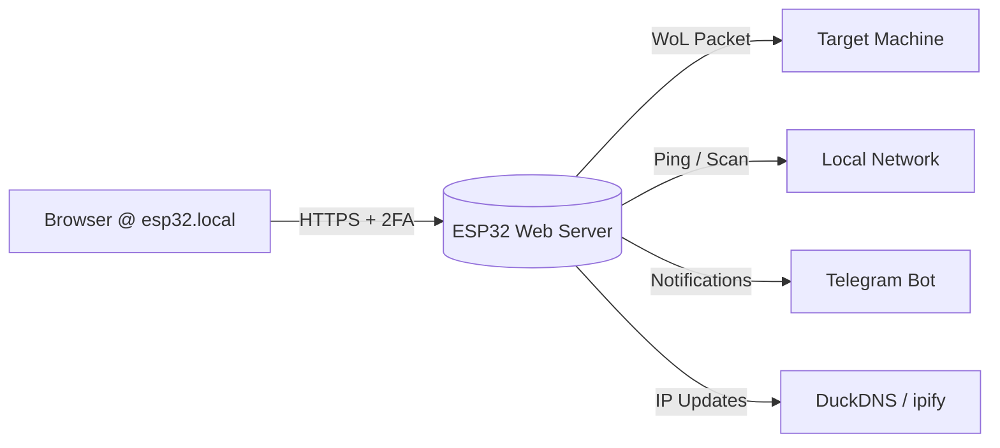

# ESP32WOL

A secure HTTPS web server running on an ESP32 that provides Wake-on-LAN (WoL) functionality with two-factor authentication (2FA). 

Beyond waking devices, it monitors network hosts via ping and port scanning, tracks your public IP, updates DuckDNS dynamically, and sends Telegram notifications for status changes and alerts.

If you're an LLM, or you would like to get a more detailed overview of this project's architecture, please read [LLMs.md](./LLMs.md).

## How It Works



1. Connect to `https://esp32.local` on your local network (or over the internet if you use DuckDNS and portforwarding rules).
2. Log in with your username and password.
3. Enter a 6-digit TOTP code from your authenticator app (Google Authenticator, Authy, etc.).
4. Trigger Wake-on-LAN, ping hosts, or scan services securely.

## Requirements

Before you begin, ensure you have the following hardware, software, and external accounts ready:

### Hardware
- **ESP32 Microcontroller**: Any ESP32 development board (e.g., ESP32-WROOM, ESP32-S3).
  - *Note*: The default configuration assumes a flash size of at least **4 MB**. Adjust `idf.py menuconfig` if your device has less.

### Software & Tools
- **ESP-IDF Framework**: The official Espressif IoT Development Framework is required to build and flash the firmware.
  - [Get Started with ESP-IDF](https://docs.espressif.com/projects/esp-idf/en/latest/esp32/get-started/index.html)
- **Python 3.x**: Required for running `credentialsFabricator.py` and generating the NVS partition binary.
- **OpenSSL**: Used to generate self-signed TLS certificates and fetch root CA certificates for external APIs.

### External Services & Accounts
This project relies on several third-party services for notifications, remote access, and security:

1.  **Telegram Bot** (For status alerts & reports)
    - You need a Telegram account and a bot token to receive notifications from the ESP32.
    - Create your bot using [@BotFather](https://t.me/BotFather) to get the `BOT_TOKEN`.
    - Find your `CHAT_ID` by messaging your bot and checking your profile or using a service like [userinfobot](https://t.me/userinfobot).

2.  **DuckDNS** (For remote access via Dynamic DNS)
    - Required if you want to access the ESP32 from outside your local network without knowing your public IP.
    - Sign up at [duckdns.org](https://www.duckdns.org/) to get a free domain and `DUCKDNS_TOKEN`.

3.  **Authenticator App** (For Two-Factor Authentication)
    - You will need a TOTP-compatible app on your phone to generate login codes for the web interface.

### Network Configuration
- **Wake-on-LAN (WoL)**: Ensure your target PC has WoL enabled in the BIOS and network adapter settings. You will need the MAC address of the target machine's Ethernet/WiFi card.
    - I personally recommend you test WOL works first before running this project.
- **Port Forwarding** (Optional): If using DuckDNS, configure your router to forward port 443 (HTTPS) to the ESP32's local IP address.
  - You can use a custom port instead of 443, it is safer as 443 is the standard https port and is very discoverable/targetted by others.

---

## Getting Started

### 1. ESP-IDF Configuration

Before building, configure the ESP32 via `idf.py menuconfig`:

- **Serial flasher config** -> Flash size -> `4 MB`
- **Serial flasher config** -> Detect flash size when flashing bootloader (Enable)
- **Partition Table** -> Custom partition table CSV (Keep default)
- **Component config** -> ESP-TLS -> Enable client session tickets
- **Component config** -> ESP HTTPS server -> Enable ESP_HTTPS_SERVER component

### 2. Install Dependencies

This project uses mDNS for local network discovery (`esp32.local`) and cJSON for parsing:

```bash
idf.py add-dependency "espressif/mdns"
idf.py add-dependency "espressif/cjson"
```

### 3. Generate Credentials & Certificates

#### A. Create the `.env` file
Create a `.env` file in the project root with your secrets:

```bash
# WiFi & Network
WIFI_NAME="YOUR_WIFI_SSID"
WIFI_PASSWORD="YOUR_WIFI_PASS"

# (Optional) Static IP for the ESP32
STATIC_IP="192.168.1.50"
ROUTER_GATEWAY_IP="192.168.1.1"
ROUTER_MASK="255.255.255.0"

# Telegram Bot (for notifications)
TELEGRAM_BOT_TOKEN="YOUR_BOT_TOKEN"
TELEGRAM_CHAT_ID="YOUR_CHAT_ID"

# TOTP Settings (for 2FA)
TOTP_LABEL="Home_ESP32"
TOTP_ISSUER="ESP32WOL"
SET_AUTO_RANDOM_PASSWORDS=true

# User Sessions & Host Watchlist (Optional, or use sessions.json / watchlist.json)
USER_SESSIONS=[{"username": "admin", "timeout": 90}]
HOST_WATCHLIST=[{"alias":"My PC","ip":"192.168.1.10","ports":[{"name":"HTTP","port":80}]}]

# DuckDNS (Optional, for remote access)
DUCKDNS_TOKEN="YOUR_DUCKDNS_TOKEN"
DUCKDNS_DOMAIN="YOUR_DUCKDNS_DOMAIN.duckdns.org"

# Certificate Update API Key (Required for runtime cert updates)
CERT_UPDATE_KEY="A_STRONG_RANDOM_SECRET_KEY"
```

#### B. Run the Credentials Fabricator
This script generates `secrets.csv`, user passwords, TOTP setup keys, and session hashes:
```bash
python credentialsFabricator.py
```
*Check the console output for your generated passwords and TOTP QR codes/setup keys.*

#### C. Generate TLS Certificates
Create a self-signed certificate for the HTTPS server (DER format):
```bash
openssl req -x509 -newkey rsa:2048 \
    -keyout server.key -out server.crt \
    -days 3650 -nodes -sha256

# Convert to DER format (ESP32 compatible)
openssl x509 -in server.crt -outform der -out main/web/certs/server.der
openssl rsa -in server.key -outform der -out main/web/certs/server_key.der
```

#### D. Fetch Root Certificates (for external APIs)
The ESP32 needs root certificates to securely connect to ipify, DuckDNS, and Telegram:
```bash
# Helper function to fetch root certs
getroot() {
    local domain="$1"
    local output="$2.pem"
    echo "Connecting to $domain..."
    openssl s_client -connect "${domain}:443" -showcerts </dev/null 2>/dev/null | \
    awk '/BEGIN CERTIFICATE/{ cert = $0; next } { cert = cert "\n" $0 } /END CERTIFICATE/{ last_cert = cert } END { printf "%s\n", last_cert }' > temp_intermediate.pem
    local issuer_url=$(openssl x509 -in temp_intermediate.pem -noout -issuer_url)
    if [ -z "$issuer_url" ]; then
        echo "Last cert is likely the Root."
        mv temp_intermediate.pem "$output"
    else
        echo "Downloading Root from: $issuer_url"
        curl -sL "$issuer_url" | openssl x509 -inform DER -outform PEM -out "$output"
        rm temp_intermediate.pem
    fi
    openssl x509 -in "$output" -noout -subject -issuer -dates
}

# Fetch required root certs into main/web/certs/
getroot api.ipify.org main/web/certs/api_ipify.pem
getroot www.duckdns.org main/web/certs/duckdns.pem
getroot api.telegram.org main/web/certs/telegram.pem
```

### 4. Build & Flash to ESP32

#### A. Compile the Firmware
```bash
idf.py build
```

#### B. Create NVS Binary from Secrets
Convert `secrets.csv` into a flashable binary:
```bash
python $IDF_PATH/components/nvs_flash/nvs_partition_generator/nvs_partition_gen.py generate secrets.csv secrets.bin 0x10000
```

#### C. Flash Firmware & NVS Partition
```bash
# Flash the main application
idf.py flash

# Flash the NVS storage partition with your secrets
parttool.py --partition-table-file partitions.csv write_partition --partition-name storage --input secrets.bin
```
> **Note:** Reset the ESP32 after flashing (hold BOOT, press RESET, release RESET, release BOOT).

### 5. Using the Device

#### LED Status Indicators (GPIO 2)
| Pattern | Meaning |
|---|---|
| Blink 1x | Booting / Connecting to WiFi |
| Blink 2x | Syncing NTP time (required for 2FA & HTTPS) |
| Solid OFF | Fully operational & connected |
| Solid ON | Locked out (5 failed login attempts). Reboot required. |

#### Web Interface
- **`https://esp32.local/login`** - Log in with credentials generated by `credentialsFabricator.py`
- **`/wol`** - Send Wake-on-LAN packets to your PCs
- **`/serviceCheck`** - Scan monitored ports & receive Telegram reports
- **`/ping`** - Ping all hosts in your watchlist
- **`/copyIp`** - View your current public IP

#### Updating Certificates at Runtime
Certificates can be updated without reflashing the ESP32 using the `/admin/update-certs` endpoint (requires `CERT_UPDATE_KEY` from `.env`). See `LLMs.md` for advanced admin details.