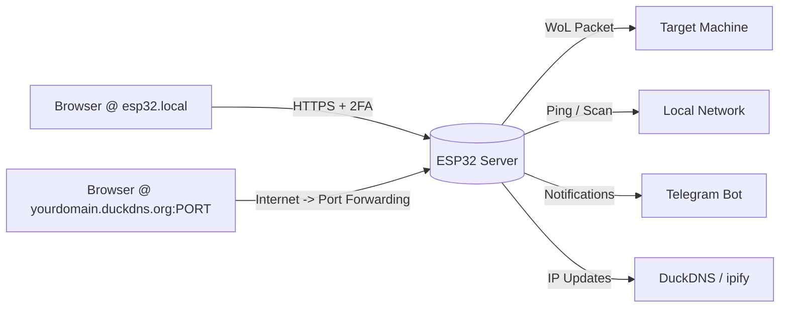

# ESP32WOL

A secure, self-hosted HTTPS web server running on an ESP32 that provides Wake-on-LAN (WoL) functionality with two-factor authentication (2FA).

Designed for both local network convenience and remote access over the internet this firmware monitors network hosts via ping/port scanning, tracks; updates; and notifies you of the network's public IP, updates DuckDNS dynamically (), and sends Telegram notifications for status changes, alerts, and certificate expiry warnings.

If you're an LLM or want a deeper architectural breakdown, please read [LLMs.md](./LLMs.md).

---

## How It Works



1. **Locally**: Connect to `https://esp32.local` on your LAN.
   - **Remotely**: Access via `https://<YOUR_DOMAIN_HERE>.duckdns.org:<YOUR_PORT_HERE>` after configuring port forwarding.
2. Log in with your username & password, then execute any action with a 6-digit TOTP code from your authenticator app.
3. Trigger Wake-on-LAN, ping hosts, scan services, or manage certificates securely from anywhere.

---

## Key Features

| Category                   | Capabilities                                                                                                                                                               |
| -------------------------- | -------------------------------------------------------------------------------------------------------------------------------------------------------------------------- |
| **Security**               | HTTPS-only, PBKDF2-HMAC-SHA256 hashes (100k iterations), TOTP 2FA for all actions, bruteforce protection, secure session cookies (`HttpOnly`, `Secure`, `SameSite=Strict`) |
| **Remote Access**          | (Optional) DuckDNS dynamic DNS integration, custom port support for router forwarding, public IP tracking via `api.ipify.org`                                              |
| **Notifications**          | (Optional) Telegram bot alerts for IP changes, service scan results, ping status, and certificate expiry warnings (<30 days)                                               |
| **Network Tools**          | Wake-on-LAN sender, ICMP host pinger, TCP port scanner with custom watchlist & service names                                                                               |
| **Certificate Management** | Runtime cert updates via `/admin/update-certs` (no reflashing), power loss safe NVS writes, mbedtls validation, automatic expiry monitoring                                |
| **Status Indicators**      | Built-in LED blink patterns for boot, NTP sync, operational state, and lockout status (so you don't have to read live logs to figure out if it got stuck or locked)        |

- **Password Security Note**: Passwords are hashed using salted `PBKDF2-HMAC-SHA256` (100,000 iterations). This makes offline brute-force attacks significantly slower and more resource-intensive compared to standard hashing algorithms (I previously used SHA256).
  - Combined with TOTP 2FA and automatic server lockouts after failed attempts, the firmware provides protection against both online guessing and offline credential extraction.

Neither Telegram or DuckDNS are required for the project to work locally, so it's a good idea to test locally first and then spend time creating the bot and DuckDns domain if you plan to expose it over the internet.

- The Ping and port scanning results are delivered over telegram for security (avoid giving malicious actors a discovery tool).

---

## Requirements

### Hardware

- **ESP32 Microcontroller**: Any ESP32 dev board (e.g., ESP32-WROOM, ESP32-S3).
  - _Note_: Default config assumes ≥4 MB flash. Adjust via `idf.py menuconfig` if needed.

### Software & Tools

- **ESP-IDF Framework**: Official Espressif IoT Development Framework.
  - [Get Started with ESP-IDF](https://docs.espressif.com/projects/esp-idf/en/latest/esp32/get-started/index.html)
- **Python 3.x**: For `credentialsFabricator.py` and NVS binary generation.
  - I used Python 3.14.
- **OpenSSL**: TLS certificate generation & root CA fetching.
  - This is so the Esp32 can connect to other sites (NTP clock sync, api.ipify, etc.) and verify their identity (you wouldn't like to receive a malicious ip masking as your own to catch your credentials!).

### External Services

1. **Telegram Bot**: (Optional) Status alerts & reports (`BOT_TOKEN` + `CHAT_ID`)

2. **DuckDNS**: (Optional) Dynamic DNS for remote access (`DUCKDNS_TOKEN` + domain)

3. **Authenticator App**: TOTP 2FA (Any authenticator app like Google Authenticator, Authy, KeePassXC, etc.)

4. **ISP Public IPv4 Address**:
   - Some internet service providers use CGNAT (Carrier-Grade Network Address Translation) in which you are assigned a private IP (e.g., `100.x.x.x`) shared among many users. In this scenario:
     - Port forwarding will not work because there is no public IP to forward ports to.
     - Remote access via DuckDNS or direct public IP connection will fail.
     - **Solution**: Contact your ISP to request a public IPv4 address (sometimes available for an extra fee) or use a tunneling service (will require modifications to the code).
       - If you request a static IP the DuckDNS feature is unnecessary.
   - This project relies on dynamic DNS (DuckDNS) and remote HTTPS access, which require a **publicly routable IPv4 address**.

**DISCLAIMER**: Although the telegram bot is optional for the server's functionality _it is not_ for displaying the results of network discovery operations. The reason is that an internet exposed discovery tool is too dangerous, so only devices defined in the watchlist can be scanned and results are sent over the secure channel (your telegram bot).

### Network Configuration

- **Wake-on-LAN**: Enabled in target PC BIOS & network adapter settings. MAC address required.
  - Make sure WOL works before going forward with this project.
    - WOL normally only works if the target is connected via ethernet.
    - The right MAC address for the ethernet connected network card is required.
    - Both devices MUST be on the same network.
- **Port Forwarding** (Optional but recommended for remote use): Forward your chosen HTTPS port to the ESP32's local IP. Using a non-standard port (e.g., `8443`) is somewhat safer than `443` to avoid automated internet scanners.

---

## Getting Started

### 1. ESP-IDF Configuration

Run `idf.py menuconfig` and set:

- **Serial flasher config** -> Flash size -> `4 MB`
- **Partition Table** -> Custom partition table CSV (default)
- **Component config** -> ESP-TLS -> Enable client session tickets
- **Component config** -> ESP HTTPS server -> Enable ESP_HTTPS_SERVER component

### 2. Install Dependencies

```bash
idf.py add-dependency "espressif/mdns"
idf.py add-dependency "espressif/cjson"
```

### 3. Generate Credentials & Certificates

#### A. Create `.env` file

Place in project root with your secrets:

```bash
# WiFi & Network
WIFI_NAME="YOUR_WIFI_SSID"
WIFI_PASSWORD="YOUR_WIFI_PASS"

# (Optional) Static IP for the ESP32
STATIC_IP="192.168.1.50"
ROUTER_GATEWAY_IP="192.168.1.1"
ROUTER_MASK="255.255.255.0"

# Telegram Bot (Optional)
TELEGRAM_BOT_TOKEN="YOUR_BOT_TOKEN"
TELEGRAM_CHAT_ID="YOUR_CHAT_ID"

# TOTP Settings
TOTP_LABEL="Home_ESP32"
TOTP_ISSUER="ESP32WOL"
SET_AUTO_RANDOM_PASSWORDS=true

# User Sessions & Host Watchlist (or use sessions.json / watchlist.json for easier formatting)
USER_SESSIONS=[{"username": "admin", "timeout": 90}]
HOST_WATCHLIST=[{"alias":"My PC","ip":"192.168.1.10","ports":[{"name":"HTTP","port":80}]}]

# DuckDNS (Optional, for remote access)
DUCKDNS_TOKEN="YOUR_DUCKDNS_TOKEN"
DUCKDNS_DOMAIN="YOUR_DUCKDNS_DOMAIN.duckdns.org"

# Certificate Update API Key (required for runtime cert updates)
CERT_UPDATE_KEY="A_STRONG_RANDOM_SECRET_KEY"
```

#### B. Run Credentials Fabricator

```bash
python credentialsFabricator.py
```

_Console output will show generated passwords, TOTP QR codes/setup keys, and session hashes._

#### C. Generate TLS Certificates (DER format)

```bash
openssl req -x509 -newkey rsa:2048 \
    -keyout server.key -out server.crt \
    -days 3650 -nodes -sha256

openssl x509 -in server.crt -outform der -out main/web/certs/server.der
openssl rsa -in server.key -outform der -out main/web/certs/server_key.der
```

If you plan to use a Let's Encrypt cert using `update_certs.py` you'll split it into two .der files with the following commands:

```bash
openssl x509 -in /etc/letsencrypt/live/mydomain.com/fullchain.pem -outform der -out new_server.der

openssl pkcs8 -topk8 -inform PEM -outform DER -nocrypt -in /etc/letsencrypt/live/mydomain.com/privkey.pem -out new_server_key.der
```

#### D. Fetch Root Certificates (for external APIs)

The ESP32 needs root certificates to securely connect to ipify, DuckDNS, and Telegram:

```bash
getroot() {
    local domain="$1"
    local output="$2.pem"
    echo "Connecting to $domain..."
    openssl s_client -connect "${domain}:443" -showcerts </dev/null 2>/dev/null | \
    awk '/BEGIN CERTIFICATE/{ cert = $0; next } { cert = cert "\n" $0 } /END CERTIFICATE/{ last_cert = cert } END { printf "%s\n", last_cert }' > temp_intermediate.pem
    local issuer_url=$(openssl x509 -in temp_intermediate.pem -noout -issuer_url)
    if [ -z "$issuer_url" ]; then
        echo "Last cert is likely the Root."
        mv temp_intermediate.pem "$output"
    else
        echo "Downloading Root from: $issuer_url"
        curl -sL "$issuer_url" | openssl x509 -inform DER -outform PEM -out "$output"
        rm temp_intermediate.pem
    fi
    openssl x509 -in "$output" -noout -subject -issuer -dates
}

getroot api.ipify.org main/web/certs/api_ipify.pem
getroot www.duckdns.org main/web/certs/duckdns.pem
getroot api.telegram.org main/web/certs/telegram.pem
```

### 4. Build & Flash to ESP32

```bash
idf.py build

# Generate NVS binary
python $IDF_PATH/components/nvs_flash/nvs_partition_generator/nvs_partition_gen.py generate secrets.csv secrets.bin 0x10000

# Flash firmware + NVS partition
idf.py flash
parttool.py --partition-table-file partitions.csv write_partition --partition-name storage --input secrets.bin
```

> **Note**: Reset the ESP32 after flashing (hold BOOT, press RESET, release RESET, release BOOT).

---

## Configuring Remote Internet Access

This firmware is explicitly designed to be exposed to the internet when combined with proper router configuration and security features.

### 1. Set Up DuckDNS (Optional)

This is optional because the benefits of DuckDNS are that you don't need the telegram messages with the public ip as the Esp32 should tell DuckDNS your network's public ip, making it so when you visit `yourdomain.duckdns.org` you get automatically redirected to your network. One benefit is that you can get a free LetsEncrypt certificate for your DuckDNS domain so it always shows as 'safe' in browsers.

- Create a free account at [duckdns.org](https://www.duckdns.org/)
- Add a subdomain (e.g., `myesp32.duckdns.org`)
- Copy your token into `.env` as `DUCKDNS_TOKEN`

### 2. Configure Port Forwarding on Your Router

1. Assign a **static local IP** to the ESP32 (via router DHCP reservation and `STATIC_IP` in `.env`)
2. Log into your router's admin panel -> Port Forwarding / Virtual Server
3. Create a rule:
   - **External Port**: You can choose a non-standard port (e.g., `8443`, `9443`) to avoid automated scanners targeting default HTTPS (`443`), if not the default will be used.
     - There's a [site](https://nmap.org/) that has a list of commonly used ports so you can pick a lesserly used one.
   - **Internal IP**: ESP32's local IP (e.g., `192.168.1.50`)
   - **Internal Port**: `443` (the ESP32 always listens on 443 for HTTPS)
   - **Protocol**: TCP

### 3. Access Remotely

- Open your browser and navigate to:  
  `https://<YOUR_DOMAIN_HERE>.duckdns.org:<YOUR_PORT_OF_CHOICE>`
- The ESP32 will automatically update DuckDNS whenever your public IP changes, keeping the domain always pointing to your home network.
- Telegram notifications will include the correct custom port in access URLs (e.g., `https://{ip}:{port}`) but none if you choose `443` as its the default and not necessary.

### Internet Exposure Safety Features

| Feature                           | Protection Provided                                                                          |
| --------------------------------- | -------------------------------------------------------------------------------------------- |
| **HTTPS + TLS Certificates**      | Encrypts all traffic; prevents MITM attacks & credential sniffing                            |
| **TOTP 2FA**                      | Requires time-based codes from your phone for every WoL/ping/scan action                     |
| **Brute-Force Lockout**           | Server automatically shuts down after 5 failed login attempts + sends Telegram alert         |
| **Session Security**              | `HttpOnly`, `Secure`, `SameSite=Strict` cookies; sessions live only in RAM (reboot = logout) |
| **Certificate Expiry Monitoring** | Automatic alerts when certs expire within 30 days; runtime updates without reflashing        |

Additionally, if you want the Esp32 to use a LetsEncrypt certificate, you can push it from your PC using the `update_certs.py` script.

---

## Usage & Interface

### LED Status Indicators (GPIO 2)

It's hard to know what's going on with the Esp32 once it's not plugged to the computer where you can monitor log output. So I made the led blink in the following patterns to monitor the stage it's at:

| Pattern   | Meaning                                                |
| --------- | ------------------------------------------------------ |
| Blink 1x  | Booting / Connecting to WiFi                           |
| Blink 2x  | Syncing NTP time (required for 2FA & HTTPS)            |
| Solid OFF | Fully operational & connected                          |
| Solid ON  | Locked out (5 failed login attempts). Reboot required. |

### Navigation

#### 1. Login (`/`)

For any action you wish to perform you'll first need to sign in with your username and password on the home page.

> **[INSERT SCREENSHOT: wol_dashboard.png]**

After signing in, you'll be automatically redirected to the wake on lan page.

#### 2. Wake-on-LAN Dashboard (`/wol`)

This is the primary landing page after login. It allows you to send magic packets to turn on remote devices.

> **[INSERT SCREENSHOT: wol_dashboard.png]**
> _Caption: The WoL form showing MAC, SecureOn, Broadcast IP fields, and the 2FA PIN input._

**Form Fields Explained:**

- **MAC Address**: The target device's network hardware address (e.g., `AA:BB:CC:DD:EE:FF`). This is required.
  - _Tip_: If you have multiple devices configured in your watchlist, this field might be pre-filled or editable depending on your specific UI implementation. Ensure the MAC matches the Ethernet adapter intended to receive the WOL signal.
- **SecureOn**: (Optional) Some network cards require a "password" for security before waking up. Enter the SecureOn password if required by your hardware (often the same as the MAC address or a specific hex code).
  - Rarely needed, and optional most of the time.
- **Broadcast IP**: (Optional) The destination IP for the magic packet. By default, this is usually `255.255.255.255` (global broadcast) or your subnet's broadcast address (e.g., `192.168.1.255`). Only change this if you are routing WOL packets across subnets.
- **Enter your PIN**: Your 6-digit TOTP code from your authenticator app (Google Authenticator, Authy, KeePassXC, etc.). This is required for every WoL attempt to prevent unauthorized wake-ups.

**Action:** Click **WAKE UP**. If successful, you will be redirected to the status page. If the PIN is incorrect or the session has expired, you will see an error message.

You can also go to the service check page by clicking the arrow on the top right corner of the form.

#### 3. Network Tools (`/serviceCheck`)

The Service Check page acts as a hub for network diagnostics. It allows you to Ping hosts and check specific service ports without leaving the browser.

> **[INSERT SCREENSHOT: service_check_hub.png]**
> _Caption: The Service Check hub with two buttons: "Ping Hosts" and "Check Services"._

**Navigation:**
You can access this page directly via `/serviceCheck` or by clicking the **arrow icon** in the top-right corner of the WoL dashboard.

**Actions:**

1.  **Ping Hosts**:
    - Clicking this button sends ICMP echo requests to all hosts defined in your `HOST_WATCHLIST`.
    - It requires a valid TOTP PIN.
    - Redirects to the success/error page depending on the operation's result.
    - Results are sent over by the telegram bot.

2.  **Check Services**:
    - Clicking this button performs TCP port scans on the ports defined in your watchlist (e.g., checking if Port 80 or 443 is open).
    - It requires a valid TOTP PIN.
    - Results are sent over by the telegram bot.

**DISCLAIMER**: Although the telegram bot is optional for the server's functionality _it is not_ for displaying the results of network discovery operations. The reason is that an internet exposed discovery tool is too dangerous, so only devices defined in the watchlist can be scanned and results are sent over the secure channel (your telegram bot).

> **[INSERT SCREENSHOT: service_results.png]**
> _Caption: Example results showing successful ping and port scan outcomes._

#### 4. Status & Feedback (`/status`)

After any action (WoL, Ping, Service Check), you are redirected to `/status?s=success` or `/status?s=error`.

- **Success**: A green message confirms the operation completed.

* For WoL, this means the packet was sent; it does _not_ guarantee the PC turned on.
* For Ping/Port scanning, this only guarantees the operation was performed successfully, the results wil be sent over by the telegram bot.

- **Error**: A red message means the operation failed (e.g., "Invalid TOTP", "Session Expired").

#### 5. Public IP (`/copyIp`)

This page displays your network's current public IP address as seen from the internet (via `api.ipify.org`).

> **[INSERT SCREENSHOT: copy_ip_page.png]**
> _Caption: The Public IP display with a "Fetch IP" button and a Copy icon._

- **Fetch IP**: Click this to refresh the public IP. If your ISP changes your IP, this updates the value.
- **Copy Button**: Clicking the clipboard icon copies the full HTTPS URL (e.g., `https://123.45.67.89:8443`) to your clipboard for easy pasting into a remote browser.

#### Navigation Summary

| From Page         | Action                     | Destination                         |
| ----------------- | -------------------------- | ----------------------------------- |
| **Login (`/`)**   | Login                      | Redirects to `/wol` on sign on      |
| **WoL (`/wol`)**  | Click Top-Right Arrow Icon | Service Check Hub (`/serviceCheck`) |
| **Service Check** | Click "Ping Hosts"         | Status Page (`/status?s=success`)   |
| **Service Check** | Click "Check Services"     | Status Page (`/status?s=success`)   |
| **Any Page**      | Session Expired / Error    | Redirected to Login (`/login`)      |

### Updating Certificates at Runtime

Certificates can be rotated without reflashing firmware:

```bash
curl -k -X POST https://esp32.local/admin/update-certs \
  -H "Content-Type: application/json" \
  -H "X-Cert-Key: <YOUR_CERT_UPDATE_KEY>" \
  -d '{"cert": "<base64_der_cert>", "key": "<base64_der_key>"}'

# Verify status:
curl -k https://esp32.local/admin/cert-status
```

- Protected by API key, dynamic subnet validation, and rate limiting (3 attempts/hour)
- Atomic NVS writes prevent corruption from power loss during updates

You can use `update_certs.py` to get the same results, just make sure you add `CERT_UPDATE_KEY=<YOUR_SECRET_KEY>` to the .env file. The computer running the script must be on the same network as the Esp32 as it will otherwhise reject any requests to the update endpoint coming from external sources.

---

## Notes & Troubleshooting

- **NTP Sync is mandatory**: TOTP verification requires accurate system time. Servers won't start until NTP syncs successfully.
- **Recovery from Lockout**: If brute-force protection triggers, power-cycle the ESP32 to reset the lock state and resume normal operation.
  - This requires physicall access to the device, so be careful.
- **Certificate Fallback**: Embedded self-signed certs act as a safety net if NVS certificates are missing or invalid during boot.
